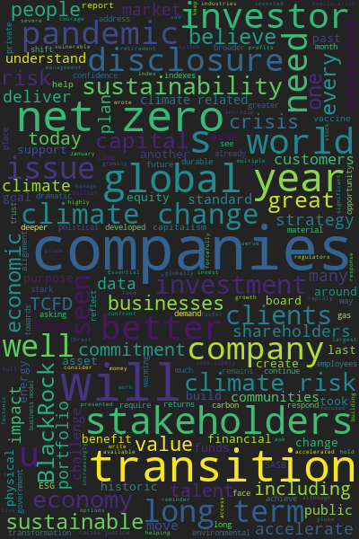

Visualizing Words 🧩
===================

<br>

<h2>Overview</h2>

This is a simple python app that uses the streamlit framework. User can copy paste a collection of words and python will sort <br> and visualize the most used words.

<br>

Run App locally
-----------------------

```py
pip3 install -r requirements.txt

streamlit run wordviz.py
```

<br>

Live Site
------------
The Streamlit library builds your python code into a web application that you can deploy on the cloud. No HTML, CSS, or JavaScript <br>
needed! 😃 This is extremely powerful if you are shipping small data projects. 

<br>

<a href="https://share.streamlit.io/nfaltir/word_visualizer/main/wordviz.py" target="_blank">Live Site</a>

<br>

Demo
-------
Figure 1, Larry Fink's letter to CEO(s)


<br><i>Output Figure</i>
<br>


<br>
